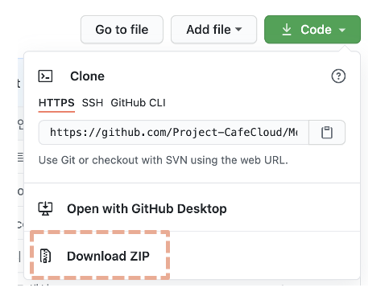

<h1>MOCA</h1>

> 카페 큐레이션 플랫폼


## 유저 플로우

추가 예정


## 핵심기능

1. 로그인 / 회원가입
2. 주변 카페 리스트(지도) - 길찾기
3. 모카 검증카페 - 홈, 상세페이지, 상세평 (검증위원)
4. 모카 플러스 - 매거진 형태의 컨텐츠 제공
5. 카테고리 - 특정 컨셉, 핫플레이스(지역/서울 한정)
6. 소셜피드 - 검색, 팔로잉한 유저가 올린 카페 리뷰 포스팅을 볼 수 있다.
7. 마이페이지 - 찜한카페, 음료쿠폰, 알림


## 프로젝트 실행 방법 (Mac OS 기준)

1. 우측 상단 Code > Download ZIP



2. 다운로드 받은 zip 파일 압축 해제

3. Android Studio 실행

[Android Studio 다운로드 링크](https://developer.android.com/studio?hl=ko&gclid=Cj0KCQjw-LOEBhDCARIsABrC0TlEhelaCoJlxNHFTlJDpXve0kye5FLmLCHVMJpL71lxN9QheemY_noaApbHEALw_wcB&gclsrc=aw.ds)

4. Android Studio > File > New > Import Project > 압축 해제한 프로젝트 폴더 선택


5. No Devices > AVD Manager


6. Create Virtual Device > Pixel 3 선택 > Next


7.  Virtual Device Configuration > Pie 선택 > Next > Finish


8.  ▶️ 버튼 클릭 해서 실행 


9. 실행 완료


## 개발 환경

- 최소 SDK 버전 23
- 타겟 SDK 버전 28


## 사용 라이브러리

```groovy
dependencies {
        implementation fileTree(include: ['*.jar'], dir: 'libs')
        implementation "org.jetbrains.kotlin:kotlin-stdlib-jdk7:$kotlin_version"
        implementation 'com.android.support:appcompat-v7:28.0.0'
        implementation 'com.android.support.constraint:constraint-layout:1.1.3'
        testImplementation 'junit:junit:4.12'
        androidTestImplementation 'com.android.support.test:runner:1.0.2'
        androidTestImplementation 'com.android.support.test.espresso:espresso-core:3.0.2'
				// Kotlin 관련
        implementation 'org.jetbrains.anko:anko:0.10.8'
				// 레이아웃
        implementation 'com.android.support:support-v4:28.0.0'
        implementation 'com.android.support:design:28.0.0'
        implementation 'com.android.support:recyclerview-v7:28.0.0'
        implementation 'de.hdodenhof:circleimageview:2.2.0'
        implementation 'com.android.support:cardview-v7:28.0.0'
        implementation 'net.yslibrary.keyboardvisibilityevent:keyboardvisibilityevent:2.2.0'
        implementation 'com.github.bumptech.glide:glide:4.8.0'
        implementation "com.airbnb.android:lottie:2.1.0"
        // 이미지 확대
        implementation 'com.github.chrisbanes:PhotoView:2.1.0'
				// 통신
        implementation 'com.squareup.retrofit2:retrofit:2.5.0'
        implementation 'com.squareup.retrofit2:converter-gson:2.1.0'
        // 구글 맵 API
        implementation 'com.google.android.gms:play-services-maps:16.0.0'
        implementation 'com.google.android.gms:play-services-location:16.0.0'
    }
```

- [constraint layout](https://developer.android.com/training/constraint-layout?hl=ko) : Constraint Layout을 활용해 UI 구성을 위한 사용
- [anko](https://github.com/Kotlin/anko) : android framework의 보일러 플레이트 코드를 제거하기 위해 사용 (startActivity, intentFor, Toast)
- [recylerview](https://developer.android.com/guide/topics/ui/layout/recyclerview?hl=ko) : 리스트 형식의 뷰를 구현하기 위해 사용
- [circleimageview](https://github.com/hdodenhof/CircleImageView) : 프로필 이미지를 둥근 형식으로 구현하기 위해 사용
- [cardview](https://developer.android.com/guide/topics/ui/layout/cardview?hl=ko) : 카드 형식의 뷰를 구현하기 위해 사용
- [lottie](https://airbnb.io/lottie/#/) : 애프터이펙트로 만든 애니메이션을 적용하기 위해 사용
- [photoview](https://github.com/Baseflow/PhotoView) : 이미지를 드래그로 확대/축소 하기 위해 사용
- [retrofit2](https://square.github.io/retrofit/) + [gson](https://github.com/google/gson) : JSON 데이터를 이용한 REST 서버 통신을 위해 사용
- [glide](https://github.com/bumptech/glide) : 이미지 로딩을 위해 사용 (URL 로드, URI 로드, placeholder 사용해 일관적인 이미지 처리)
- [google map](https://developers.google.com/maps/documentation?hl=ko) : 지도 개발을 위해 Google Map API 사용